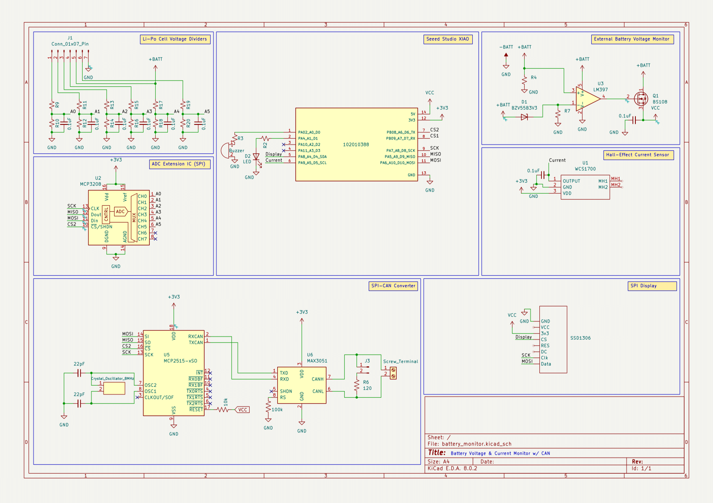
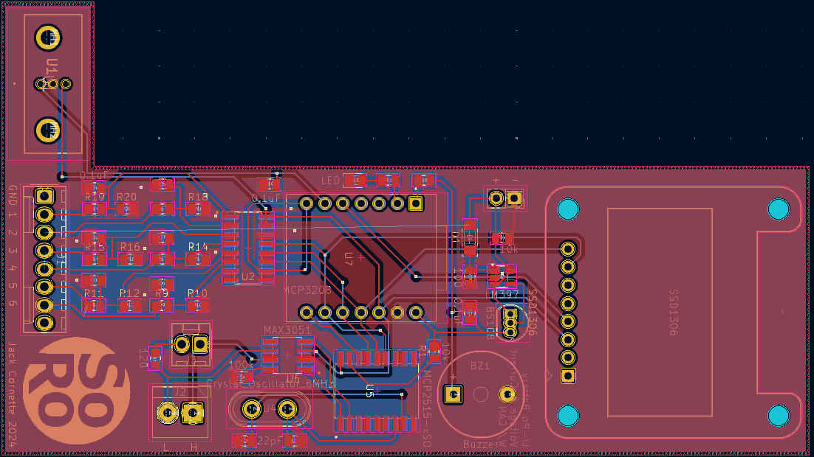

# Li-Po_Monitor
Custom Voltage and Current LiPo monitor PCB with SPI-CAN Circuit, LCD Display and piezo buzzer. Current is measured via through-hole Hall-Effect sensor with an analog output while voltage is measured in each Li-Po cell using an extended ADC IC. This was designed to monitor the Li-Po Batteries used on the Sooner Rover Team and facilitate simple integration into the CAN-Bus. 

## Parts List
- Seeed Studio XIAO mcu
- MCP3208 ADC Extension IC (SPI)
- SSD1306 LCD Display (128x64, SPI)
- WCS1700 35A Current Sensor
- MCP2515 CAN Controller (SPI)
- MAX3051 CAN Transceiver
- 8 MHz Crystal Oscillator
- LM397 Comparator
- BZV5583v3 Zener Diode
- BS108 MOSFET
- 0805 SMD Resistors
- 0805 SMD Capacitors
- 0805 LEDs
- Piezo Buzzer
- 2.54 mm Pin Headers/ Connectors
- 1x2 Screw Terminal

## Schematic

## PCB Design
